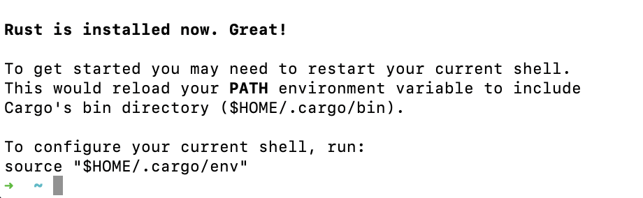
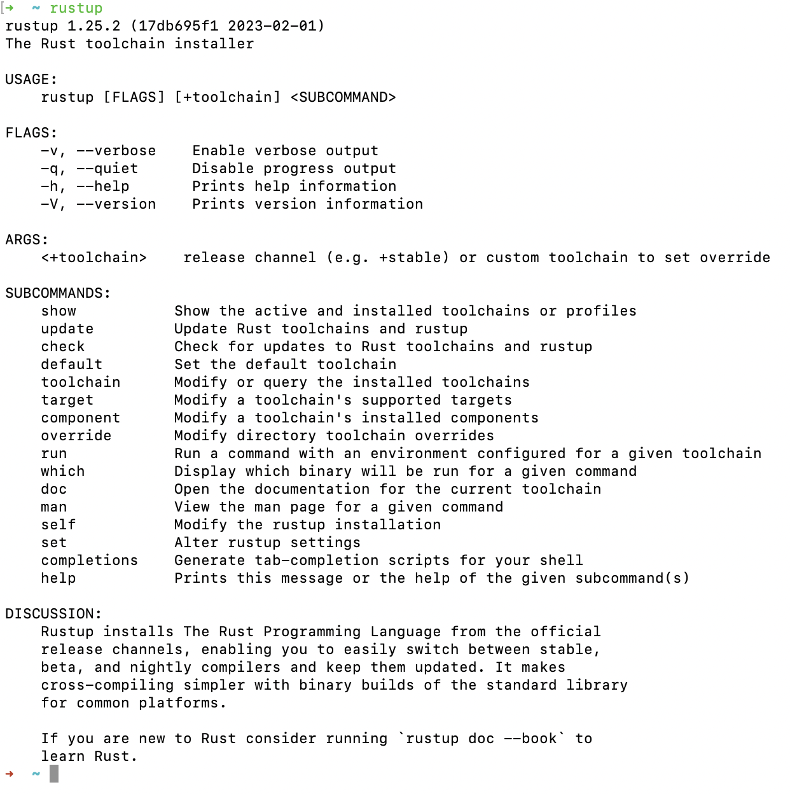
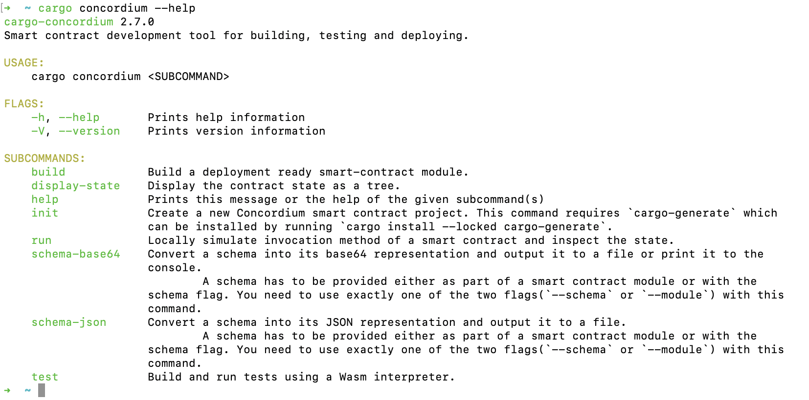
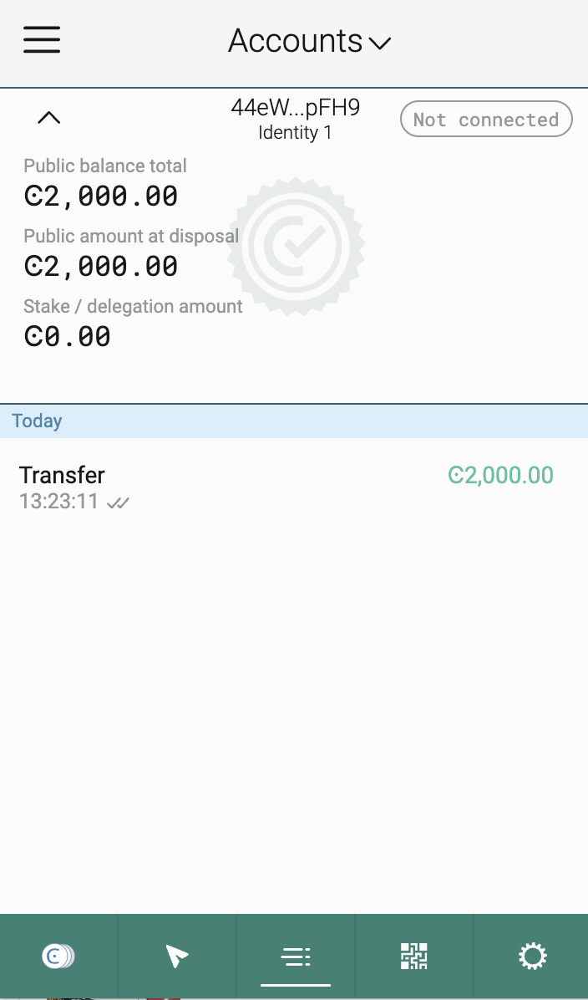
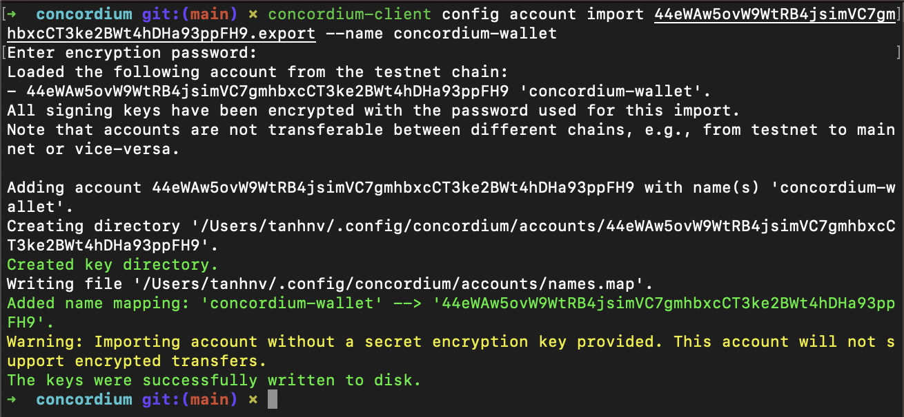

# Concordium Hackathon - TASK 1: Setup Development Environment

## My wallet address

- Concordium Address (Mainnet): 4Ab5VSBALWbNHbUwksYNstZWnTD1zrWgV57VQNbixNxFPq4yBa
- USDT Address (Metamask): 0xB883e40202417671fDaC9A2D1Dbbf6a49bDA796e

## My process - MacOS

### Install rust
- Follow https://rustup.rs/ to install rust
- Result:
  
  

### Install Cargo-concordium
- Download https://developer.concordium.software/en/mainnet/net/installation/downloads-testnet.html#cargo-concordium-testnet. Rename the downloaded file to cargo-concordium copy and paste to `$HOME/.cargo/bin`
- Run command
  ```zsh
   chmod +x ~/.cargo/bin/cargo-concordium
  ```
- Result:
  

### Install Concordium Client
- Download and Install Concordium Client: https://developer.concordium.software/en/mainnet/net/installation/downloads-testnet.html#concordium-node-and-client-download-testnet
- Result:
  

### Install Concordium Wallet & Create account
- Add chrome extension from https://chrome.google.com/webstore/detail/concordium-wallet/mnnkpffndmickbiakofclnpoiajlegmg?hl=en-US
- Create test account & Acquire testnet CCD
  

### Export the account from web wallet and import into concordium client
- To export private key: open wallet extension > Setting > Export private key 
- Run command
  ```zsh
   concordium-client config account import <YOUR PUBLIC ADDRESS.export> --name <Your-Wallet-Name>
  ```
    
